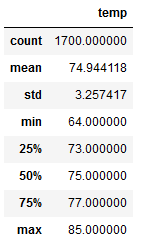
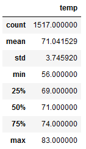

# Temperature trends in Oahu

## Overview
Analysis of temperature trends in Oahu to determine if a surf and ice cream shop is viable year round. Analsyis looks at temperatures in June and December to help inform decision of opening a new shop.

## Results
### June
Below are the summary statistics for Oahu air temperatures in June:

### December
Below are the summary statistics for Oahu air temperatures in December:

### Differences
* Average monthly temperature is 4 degrees cooler in December (71) than June (75)
* Daily high temperatures are only 2 degrees cooler in December (83) than June (85)
* Daily low temperatures have a higher variance with a 6 degree difference from December (56) to June (64)

## Summary

### Findings

### Additional analysis recommended
